<!--
 * @FilePath: \lab06_light\README.md
 * @Author: AceSix
 * @Date: 2022-06-15 21:36:49
 * @LastEditors: AceSix
 * @LastEditTime: 2022-07-09 13:25:15
 * Copyright (C) 2022 Brown U. All rights reserved.
-->

<!-- TODO:
make section 1 brief
In section 2 equation, indicate we will go through this part by part
In section 3, explain how reflection is an extension. -->

# Lab 6: Light

## 0. Intro

Lighting is an essential part of the raytracing pipeline.

In your first part of the ray project, you have already implemented the first two parts of the raytracing pipeline. The lighting is still missing, because we filled pixels using the vertex normals. Ultimately, we want our raytracers have realistic image output. In that case, lighting has to be done, and we will take a quick peek into it in this lab. You will explore more on lighting in your second part of the Ray assignment.

<!--
The idea of raytracing is to shoot a ray from the camera through a pixel, track its intersection in the scene, and compute the lighting at intersection point to get the illumination at that pixel. We focus on the lighting part of this pipeline. This step, as is shown in the figure below, is the final part of raytracing and directly leads to the final image. -->

    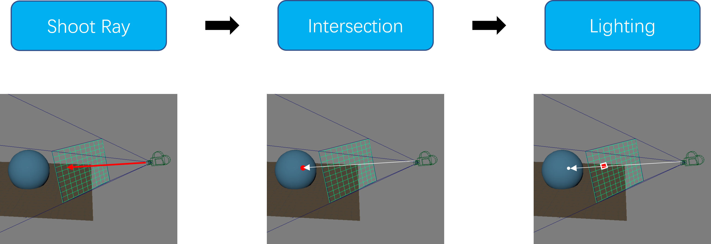
    <figcaption align = "center"> <b>Fig. 1</b> 
    Illustration of raytracing pipeline
    </figcaption>

In this lab, you will:

1. Learn about lighting and lighting models,
2. Implement the Phong illumination model, and
3. Extend it to implement other lighting effects like reflection

## 1. Context

### 1.1. What is Lighting?

**Lighting** is the simulation of how light interacts with objects in a scene. It is an essential part of rendering images from computer graphics scenes, which is what you'll be doing in `ray`.

However, [simulating light perfectly is hard](link). Thus, we use simplified **models** to approximate light simulations, instead.

<!-- [ optional: image showing that light simulation is hard ] -->

There exist many different lighting models, like the Phong, [Cook-Torrance](https://graphics.pixar.com/library/ReflectanceModel/paper.pdf), [Minnaert](https://adsabs.harvard.edu/full/1941ApJ....93..403M) and [Oren-Nayer](https://www1.cs.columbia.edu/CAVE/publications/pdfs/Oren_SIGGRAPH94.pdf) lighting models. They all model the interactions between objects and light, but with different mathematical and physical bases.

    
    <figcaption align = "center"> <b>Fig. 2</b> 
    Different lighting models.
    </figcaption>

 <!-- simulating the interaction of light with objects in the scene.  -->

### 1.2. The Phong Lighting Model

In this lab, and in your raytracer, you will be using the **Phong lighting model**. It has three main terms&mdash;ambient, diffuse, and specular&mdash;which you will learn about in greater detail in subsequent sections.

<!-- [ required: equation and image representing Phong LM ] -->

    

    

  
 But I thought rays shot out <i>from</i> the camera! 

  
  This is a moot distinction. Suck it.

Something about raytracing being "backwards".

Being realistic, raytracing has to work backwards. The "correct" order requires you to generate infinite rays from the light source and check if they reach the camera eventually.

The Phong lighting model determines the color of each pixel in your rendered image by basing it on:

- The material properties of the surface/object at the intersection point,
- The placement and properties of **light sources** in the scene, and
- Other (often arbitrarily-selected) **global parameters**, such as the weight for each component of the lighting model

In doing so, it simulates the intensity of the "light" traveling along a "ray" from the intersection point to the camera.

<!-- [ Equation ] -->

> We use the Phong illumination model in CS123 because it's simpler and fairly easy to implement.
>
> Other models based on more [complicated physical phenomena](http://www.cs.uns.edu.ar/cg/clasespdf/SRM.pdf) can be more realistic, but they also tend to require more understanding to get right, and more material parameters.

### 1.3. What You Will Do In This Lab

To get you started with lighting properly, in this lab, you will complete a function that calculates lighting with some given data.

To focus solely on the lighting part of raytracing, you won’t need to worry about shooting rays and get intersections. We will provide you with the necessary data, like intersection position, surface normals, and some global data.

#### 1.3.1. 2D Array Representation

Specifically, you will work on this function at the pixel level. You will have a 2D array of intersection data. Each element in this array contains the data you need in order to calculate its RGBA value.

    
    <figcaption align = "center"> <b>Fig. 3</b> 
    2D array processing
    </figcaption>

#### 1.3.2. Additional Global Parameters

Apart from the 2D array of intersection data, you need some global data such as coefficients for each component of illumination and light sources. In this Lab, we will only be working with point light sources. Point light is the light that shoots light rays from one simple point to all directions with the same illumination. The light color and direction is important for calculating some part of the Phong model, which we will cover more in the following contents.

    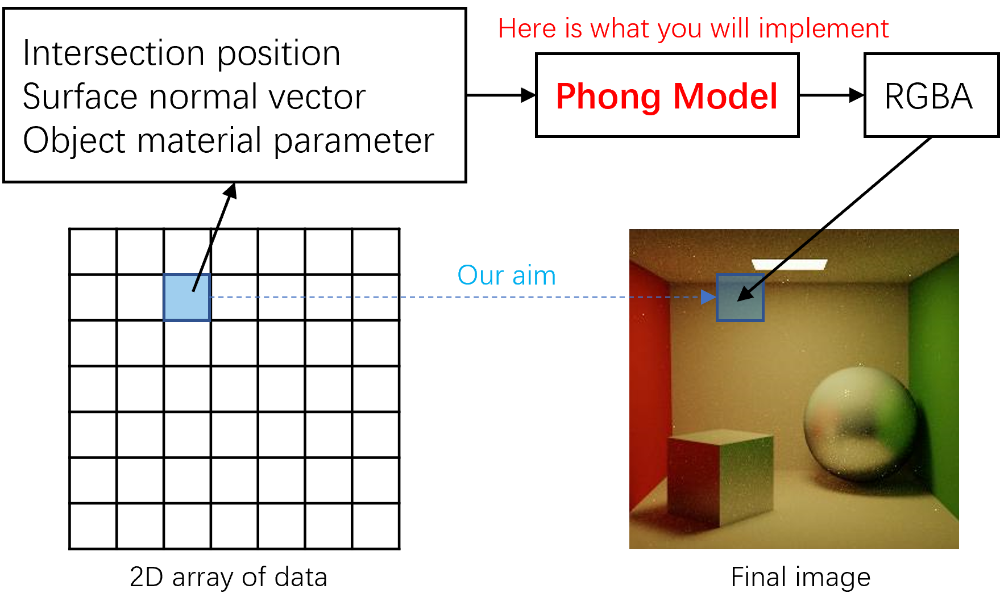
    <figcaption align = "center"> <b>Fig. 4</b> 
    Lab task illustration
    </figcaption>

**Some info**: What you finish in this lab is actually a shader program. It computes the color of each pixel with given per-pixel data. You will learn more about this in the realtime lab.

## 2. Implementing The Phong Lighting Model

Here, we will explain the basics of the phong lighting model, which you will implement. Below is phong model's equation. This equation contains three components: ambient, diffuse and specular. Together they create a pretty realistic visual effect as the image shown in Fig.5. In the remainder of this chapter, we will explain the terms of equation along with their visual effects one by one.

$$
I_{\lambda}=k_{a}O_{a\lambda}
+\sum_{i=1}^{m}f_{att}I_{\lambda,i}\left[k_{d}O_{d\lambda}({\bf\hat{N}}\cdot{\bf\hat{L}_{i}})
+k_{s}O_{s\lambda}({\bf\hat{R}_{i}}\cdot{\bf\hat{V}})^{n}\right]
$$

Where:

- $I$ is the intensity of the light (or for our purposes,you can just think of it as the color).
- $\lambda$ is the subscript for each wavelength (red,green, and blue).
- $k$ is a constant coefficient. For example, $k_{a}$ isthe ambient coefficient.
- $O$ is the color of the object being hit by the ray. Forexample, $O_{d\lambda}$ is the diffuse color at the pointof ray intersection on the object.
- $m$ is the number of lights and i is the index for eachlight.
- $I_{\lambda\,i}$: is the intensity of light i.
- ${\bf\hat{N}}$: is the normalized normal on the objectat the point of intersection.
- ${\bf\hat{L}_{i}}$: is the normalized vector from theintersection to light i.
- ${\bf\hat{R}_{i}}$: is the normalized, reflected lightvector from light i
- $f_{att}$: is the attenuation factor
- ${\bf\hat{V}}$: is the normalized line of sight vector
- n: is the specular exponent (or shininess)

 

    
    <figcaption align = "center"> <b>Fig. 5</b> 
    Complete Phong effect
    </figcaption>

### 2.0. First, A Word About Clipping

To begin with, it is important to know how our rendered image is shown on the screen. As you already know, an image is a grid of cells where each cell has its own color values. Here we use the RGBA color format, which is a tuple of four integers in the range of [0,255].

However, as you can see in the equation, the diffuse and specular components are accumulated over all the light sources in the scene. That means the light intensity we calculate may range from zero to infinity. <!-- The overall illumination can add up to infinity when there are many lights even if all parameters for material or lights are finite values.  --> Thus, we must map our output intensity values to something between 0-255.

There exists many different methods to convert light intensity to finite RGB values, here we’ve chosen the simplest method to do this: clipping to limit the intensity of each color channel to [0,1] (as it is the range of parameters we use) and scale it linearly to [0, 255]. (In the equation below, $C$ is the color of pixel, $I$ is the light intensity and $\lambda$ indicates color channel.)

$$
C_\lambda = min(max(I_\lambda, 0), 1)*255
$$

    
<b>tone mapping</b>

    

    The operation we discussed in the last chapter is technically a method of tone mapping. Tone mapping is the method to convert the high-dynamic range(zero to infinity) illumination values into low-dynamic range values that can be written to standard 24-bit RGB image formats such as JPEG or PNG. Many rendering methods, similar to raytracing, produce direct illumination values with high dynamic ranges. That is why tone mapping is crucial for most computer graphics techniques. 
    
 

    Over the time, many different ways of tone mapping have been proposed. Different functions to map high dynamic range values produce images with various visual effects. It can either be coherent across the whole image through scaling by the maximum computed illumination, or be locally adaptive so that over bright and over dark areas can be shown without loss of detail. The image below show an  of how tone mapping improve image visual quality.
    
 

        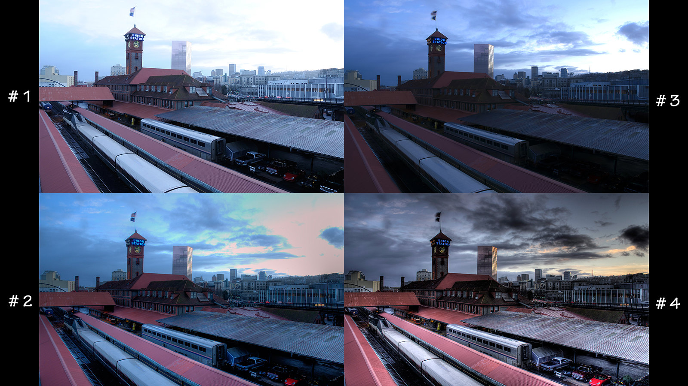
        <figcaption align = "center"> 
        <b>#1</b> is original image, over exposed. 
        <b>#2</b> is linearly tone mapped from #1. 
        <b>#3</b> is HDR processed from #1. 
        <b>#4</b> is linearly tone mapped from #3. 
        </figcaption>
    

    
<b>why did we choose this method of tone-mapping?</b>

    

    The tone mapping method we use in this lab is simply clipping and scaling, which means we are discarding all values over the limit and treating them as the maximum value. This method may cause the loss of information for areas with strong illumination. But it is very simple, stable, and effective enough for the scope of this lab. You will have the chance to discover more tone mapping techniques later in this course.
    

##### Task 0

TODO
For convenient computation, material parameters we use range from 0 to 1. It is necessary to clip the over light values, map it to $[0,255]$ and convert illumination to unsigned int values.

### 2.1 The Ambient Component

$$
I_{\lambda}={\color{blue} k_{a}O_{a\lambda}}
+\sum_{i=1}^{m}f_{att}I_{\lambda,i}\left[k_{d}O_{d\lambda}({\bf\hat{N}}\cdot{\bf\hat{L}_{i}})
+k_{s}O_{s\lambda}({\bf\hat{R}_{i}}\cdot{\bf\hat{V}})^{n}\right]
$$

We’ll start by adding in the ambient component. This component simply adds a constant amount of lighting to all objects in the scene, regardless of light sources. It simulates the effect of indirect light in a scene to avoid some parts being too dark due to lack of direct light.

    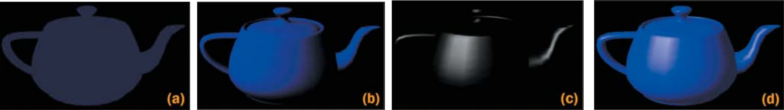
    <figcaption align = "center"> <b>Fig. 6</b> 
    Teapot with light coming from one direction. If we only have diffuse and specular light the bottom and right side of the tea pot are not visible.
    </figcaption>

    
    <figcaption align = "center"> <b>Fig. 7</b> 
    Ambient effect alone of Fig. 5
    </figcaption>

The amount of ambient light will be given by the object color (color) times the amount of ambient light (ambient Intensity). Note that there is an additional factor of ambient coefficient. The three global coefficients are human assigned values that control how much each component of the phong model contributes to the final illumination.

##### Task 1

Fill in the ambient illumination in the phong equation. Remember to apply the ambient coefficient.

### 2.2 The Diffuse Component

$$
I_{\lambda}=k_{a}O_{a\lambda}
+\sum_{i=1}^{m}f_{att}{\color{blue}I_{\lambda,i}}\left[{\color{blue} k_{d}O_{d\lambda}({\bf\hat{N}}\cdot{\bf\hat{L}_{i}})}
+k_{s}O_{s\lambda}({\bf\hat{R}_{i}}\cdot{\bf\hat{V}})^{n}\right]
$$

Now let’s add the diffuse component, which makes surfaces that are facing towards the light source appear brighter. This term is an approximation to the real world physical effect of a surface scattering the absorbed incident photons uniformly across the hemisphere. We will represent how much a surface is facing the light source with the expression ${\bf\hat{N}}\cdot{\bf\hat{L}_{i}}$, where N is the normal vector and L is the normalized vector from the surface point to the light source.

    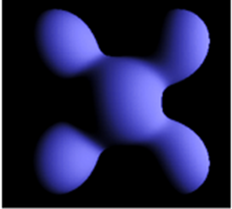
    <figcaption align = "center"> <b>Fig. 8</b> 
    Diffuse effect alone of Fig. 5
    </figcaption>

    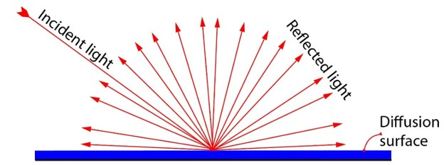
    <figcaption align = "center"> <b>Fig. 9</b> 
    Illustration of diffuse light
    </figcaption>

In the diffuse component, the production between light intensity and material color should be easily comprehensive. But you may wonder why there is a term of ${\bf\hat{N}}\cdot{\bf\hat{L}_{i}}$. based on the observation of Lambert. Lambert observed that most flat, rough surfaces reflect light energy proportional to the cosine of the angle between their surface normal and the direction of the incoming light. This is known as Lambert’s Law. The dot production of normalized vectors of surface normal and incident light calculates the cosine value of the incident angle. To understand the intuition behind this operation, you can imagine that only the component that is perpendicular to the surface of the incident light vector can be absorbed.

    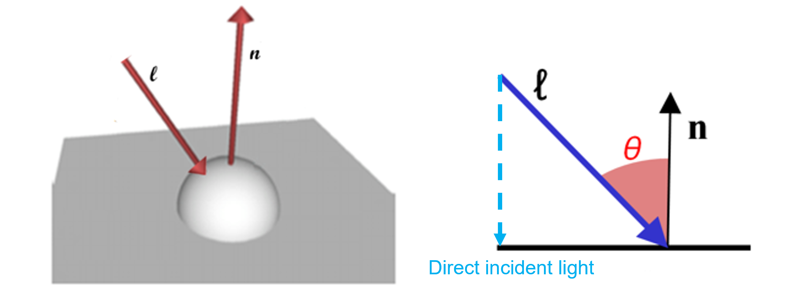
    <figcaption align = "center"> <b>Fig. 10</b> 
    Lambert’s law
    </figcaption>

##### Task 2

Compute the diffuse component and add it to the illumination. For this, you need to:

- Get the direcion from intersection point to light sources
- calculate the cosine value of angle between surface normal and light direction
- Calculate the diffuse term and apply its corresponding weight

(Beware to normalize both vectors when you calculate ${\bf\hat{N}}\cdot{\bf\hat{L}_{i}}$.)

### 2.3 The Specular Component

$$
I_{\lambda}=k_{a}O_{a\lambda}
+\sum_{i=1}^{m}f_{att}{\color{blue}I_{\lambda,i}}\left[ k_{d}O_{d\lambda}({\bf\hat{N}}\cdot{\bf\hat{L}_{i}})
+{\color{blue} k_{s}O_{s\lambda}({\bf\hat{R}_{i}}\cdot{\bf\hat{V}})^{n}}\right]
$$

Finally we have the specular component, which adds a highlight that makes objects appear shiny. This term is the approximation of the reflection of direct light. The specular component peaks in brightness when light is reflected in the direction of the eye. We will now use the dot product ${\bf\hat{R}_{i}}\cdot{\bf\hat{V}}$.

    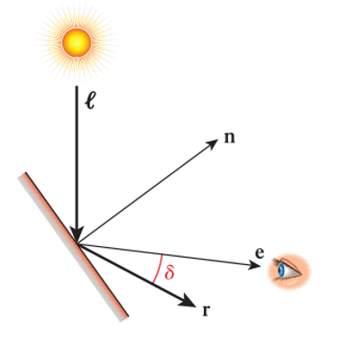
    <figcaption align = "center"> <b>Fig. 11</b> 
    Mechanism of specular light
    </figcaption>

In order to make the specular highlight small, we raise the dot product to an exponent called shininess. The higher the exponent, the smaller the highlight. The image below shows the diffuse part of Fig.3.

    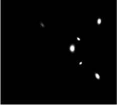
    <figcaption align = "center"> <b>Fig. 12</b> 
    Specular effect alone of Fig. 5
    </figcaption>

##### Task 3

Calculate the specular component.

- get reflection direction of the incoming light
- get eyesight direction based on the data provided.

Calculate the

### 2.4 Attenuation

$$
I_{\lambda}=k_{a}O_{a\lambda}
+\sum_{i=1}^{m}{\color{blue}f_{att}}I_{\lambda,i}\left[ k_{d}O_{d\lambda}({\bf\hat{N}}\cdot{\bf\hat{L}_{i}})
+k_{s}O_{s\lambda}({\bf\hat{R}_{i}}\cdot{\bf\hat{V}})^{n}\right]
$$

In real life, the intensity of light decreases as the distance between object and light source increases. We demonstrate the effect of attenuation in the picture below. The areas far from the light source (left or right edges) are obviously darker than areas close to the light source (center of plain).

    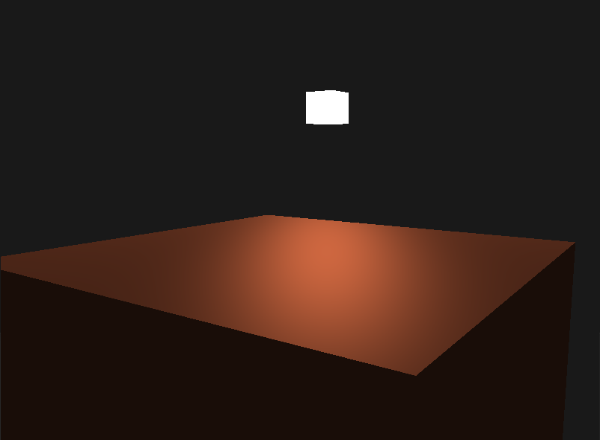
    <figcaption align = "center"> <b>Fig. 10</b> 
    Attenuation effect demonstration
    </figcaption>

##### Task 4

<!-- (May be optional) -->

Calculate the distance from intersection point to light source. Apply attenuation to the diffuse and specular component according to the function below.

$$
f_{att} = min(1, \frac{1}{c_1 + distance*c_2 + distance^2*c_3})
$$

## 3. Reflection

Now you have an image with great lighting effect after finishing the phong lighting model. We can extend the phong lighting model by adding some other component to make the image look better!

One interesting and simple extension is the mirror reflection. In a way, diffuse and specular are reflections that are loose or less concentrated. And mirror reflections are the reflections that are completely concentrated, which usually happens on perfect mirror surface. You can see the mirror reflection effect almost everywhere in your life.

    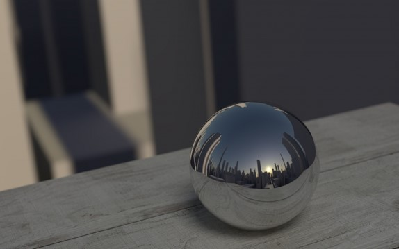
    <figcaption align = "center"> <b>Fig. 11</b> 
    Mirror reflection example
    </figcaption>

In raytracing, we achieve reflection through recursive raytracing. When we track a ray to a reflective surface, we perform raytracing again from that intersection point in the direction of reflected eyesight. However, directly adding the reflection illumination will make the overall intensity too strong. Some lighting models calculate the contribution of reflection to overall lighting according to more complex material parameters. Here we give you a fixed global coefficient $k_r$ for this.

$$
I_{r,\lambda} = k_r*Phong(Intersection, reflect({\bf N}, {\bf V}))
$$

You may wonder how many time we should do recursive tracing since the illumination from reflection intersection may have its own reflection. Usually we use the term depth to refer to the number of times we perform recursive tracing. In a well-developed raytracing program, you could set your depth to be really large for very cool effect! But we only do recursive raytracing for one time within the scope of this lab.

##### Task 5

Calculate the reflected eyesight direction. Perform raytracing again to get reflected illumination. We provide you with an interface getReflection(source, dir) to acquire reflection illumination.
